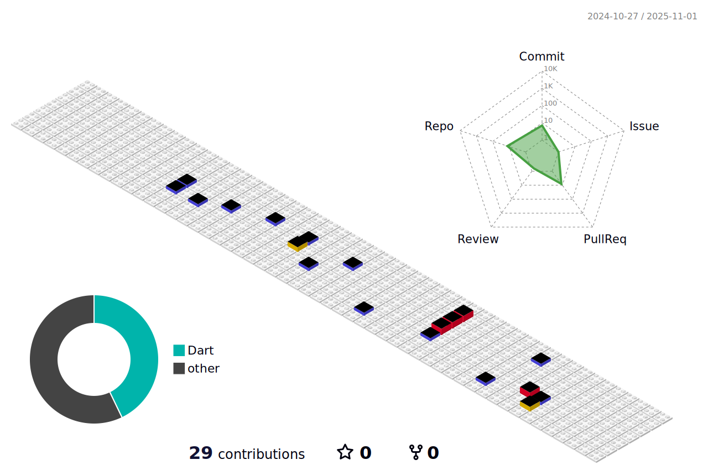

## Greetings,I'm ***Ten9*** (yeah,ten & nine)

Strive to become a qualified Web3 engineer. Additionally, proficient in HarmonyOS is also great.😍

Besides studying blockchain, I'm dedicating time to a [Robot](https://github.com/lm83680/Benny-Robot) ,her name is "Benny". Although it may take several years, I'm ready for it.This is an open-source project, and contributions are welcome.

### 💼 Toolkit

- 🌐 Web3: Ethereum, Bitcoin, Smart Contracts
- 🎃 Frontend: React, Vue.js, Flutter
- 🛠️ Backend: Python, Rust, Go
- 📱 Mobile: Flutter, Android(kotlin) , ios(swift)
- ⚙️ Version Control: Git, GitHub/GitLab
- 😶‍🌫️order: Embedded

### 🌐social

What human language can describe, the language of 0 and 1 can also achieve. Believe it.
- CSDN: [CSDN](blog.csdn.net/qq_40837841)
- e-mail: [ten.9@foxmail.com](mailto:ten.9@foxmail.com)

<picture>
  <source media="(prefers-color-scheme: dark)" srcset="https://raw.githubusercontent.com/lm83680/lm83680/output/github-contribution-grid-snake-dark.svg">
  <source media="(prefers-color-scheme: light)" srcset="https://raw.githubusercontent.com/lm83680/lm83680/output/github-contribution-grid-snake.svg">
  
</picture>

---

### open-source enthusiast / 饮水思源

